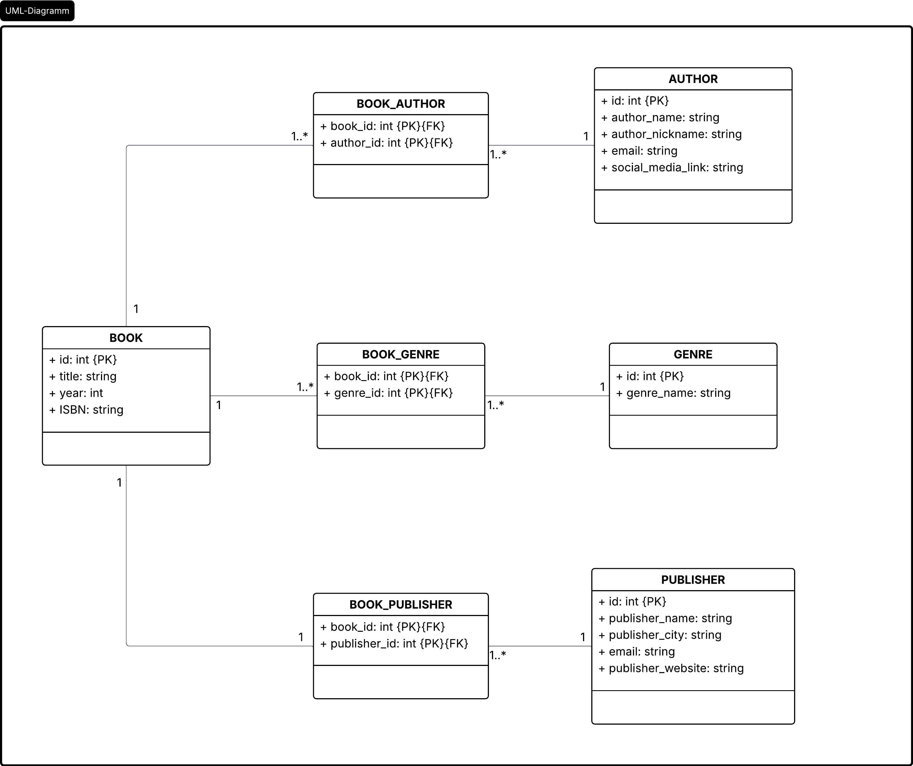

Часть выполнил - Фролов А.А., 2 курс ИВТ-2

## Описание предметной области.

В качестве проекта нам предложена предметная область - Электронная Библиотека. 
Электронная библиотека представляет собой информационную систему, предназначенную для хранения и управления данными о книгах. Система позволяет вести каталог литературных произведений, хранить сведения об авторах, жанрах и издательствах, а также выполнять поиск и фильтрацию книг по различным параметрам.

Основным объектом предметной области является книга. Для каждой книги необходимо хранить информацию о названии, годе издания и международный идентификатор ISBN. Кроме того, каждая книга может быть связана с одним или несколькими авторами, относиться к нескольким жанрам и быть выпущенной определённым издательством.

Для хранения информации об авторах система содержит сведения об их имени, возможном псевдониме и контактных данных. Для классификации литературных произведений используются жанры, позволяющие группировать книги по тематике и содержанию. Также система хранит информацию об издательствах, выпустивших книги, что позволяет осуществлять поиск и фильтрацию по издательствам.

## Реляционное представление предметной области.

Для проектирования данных удобно было рассмотреть предметную область сначала в реляционной форме. Это помогает выполнить требования по нормализации и ER-диаграмме, а затем адаптировать модель к MongoDB.

В данном разделе представлена концептуальная SQL-модель предметной области и основные сущности будущей базы данных. На текущем этапе описаны только структуры основных таблиц и их атрибуты. Информация о связях между сущностями намеренно вынесена в следующий раздел и будет представлена в виде ER-диаграммы.

Такой подход позволяет наглядно показать отношения между сущностями, включая связи типа «многие ко многим», для реализации которых в реляционной модели используются промежуточные таблицы. Подробное описание этих таблиц на данном этапе не приводится, поскольку основная цель раздела — определить ключевые сущности предметной области и их основные атрибуты.

Для хранения книг используем таблицу **Book** и создаем такие поля как:

| Название поля | Тип    | Описание                                       |
| ------------- | ------ | ---------------------------------------------- |
| id            | PK     | Ключевое поле                                  |
| title         | string | Название книги                                 |
| year          | int    | Год издания                                    |
| ISBN          | string | Международный стандартный книжный номер (ISBN) |

Для хранения  авторов используем сущность **Author**:

| Название поля     | Тип    | Описание                                           |
| ----------------- | ------ | -------------------------------------------------- |
| id                | PK     | Ключевое поле                                      |
| author_name       | string | Полное имя автора                                  |
| author_nickname   | string | Псевдоним автора если тот имеется                  |
| email             | string | контактная почта автора, если тот её указал        |
| social_media_link | string | Возможность указать ссылку на свои социальные сети |

Для хранения информации о жанрах создадим отдельную таблицу **Genre**.

| Название поля | Тип    | Описание       |
| ------------- | ------ | -------------- |
| id            | PK     | Ключевое поле  |
| genre_name    | string | Название жанра |


Так же нужно хранить небольшую информацию об издательстве, будет удобно сделать отдельную таблицу. Таким образом добавляется возможность искать книги по определенному издательству. Сущность **Publisher**

| Название поля     | Тип    | Описание                                          |
| ----------------- | ------ | ------------------------------------------------- |
| id                | PK     | Ключевое поле                                     |
| publisher_name    | string | Название издательства                             |
| publisher_city    | string | Город издательства                                |
| email             | string | контактная почта издательства, если тот её указал |
| publisher_website | string | Вебсайт издательства                              |

## ER-диаграмма в нотации UML.



#### Связи: 
- Book M:M Author - у книги может быть несколько авторов, у одного автора может быть много книг
- Book M:M Genre - у книги может быть несколько жанров, один жанр может относиться к нескольким книгам
- Book M:1 Publisher - у книги может быть несколько издательств, у одного издательства может быть много книг

## Нормализация базы данных.

При проектировании базы данных была выполнен анализ структуры данных с точки зрения нормализации с целью устранения избыточности и предотвращения возможных аномалий при добавлении, изменении и удалении информации.

Для хранения основных объектов предметной области были выделены отдельные сущности: Book, Author, Genre и Publisher. Такой подход позволяет избежать дублирования информации. Например, данные об авторе или издательстве хранятся только один раз и могут использоваться для нескольких книг.

Связи типа «многие ко многим» между книгами и авторами, а также между книгами и жанрами реализованы с помощью промежуточных таблиц Book_Author и Book_Genre. Это позволяет хранить информацию о нескольких авторах одной книги и нескольких жанрах без дублирования данных.

Каждая таблица содержит атомарные значения атрибутов, что соответствует требованиям первой нормальной формы (1НФ). Все неключевые атрибуты зависят только от первичного ключа, что соответствует второй нормальной форме (2НФ). Также в модели отсутствуют транзитивные зависимости между неключевыми атрибутами, что позволяет считать структуру базы данных приведённой к третьей нормальной форме (3НФ).

## Переход к MongoDB (основная база данных проекта)

Выбор MongoDB обусловлен тем, что данная СУБД лучше подходит для задач, связанных с хранением слабо структурированных и потенциально расширяемых данных. В рамках системы «Электронная библиотека» предполагается работа с сущностями, которые могут со временем изменяться и дополняться новыми атрибутами (например, рейтингами книг, отзывами пользователей, дополнительными характеристиками авторов или метаданными издательств). В реляционной модели такие изменения требуют модификации схемы таблиц, тогда как в MongoDB структура документа может быть расширена без изменения всей модели данных.

Дополнительным фактором выбора стало то, что основная нагрузка системы приходится на операции чтения: отображение списка книг, фильтрация, поиск по параметрам и просмотр карточки книги. MongoDB обеспечивает высокую эффективность таких операций за счёт хранения данных в виде документов, максимально приближенных к структуре выдачи пользовательского интерфейса.

Также важным преимуществом является отсутствие необходимости выполнения сложных JOIN-операций. В реляционной модели получение полной информации о книге требует объединения нескольких таблиц (книга, авторы, жанры, издательство). В MongoDB эта задача решается либо через хранение идентификаторов, либо через частичное встраивание данных, что уменьшает сложность запросов и повышает скорость выборки.

## Структура базы данных MongoDB

В рамках проекта выделены следующие основные коллекции.

#### Books (Книги)

Коллекция является центральной в системе и содержит основную информацию о книгах.

```json
{
  "_id": ObjectId(),
  "title": "1984",
  "year": 1949,
  "isbn": "978-5-17-118366-6",
  "author_ids": [
    ObjectId("...")
  ],
  "genre_ids": [
    ObjectId("...")
  ],
  "publisher_id": ObjectId("...")
}
```

Данная структура позволяет хранить минимально необходимую информацию о книге, а также связи с другими сущностями без дублирования данных.

#### Authors (Авторы)

```json
{
  "_id": ObjectId(),
  "author_name": "George Orwell",
  "author_nickname": null,
  "email": "example@mail.com",
  "social_media_link": "https://..."
}
```

#### Genres (Жанры)

```json
{
  "_id": ObjectId(),
  "genre_name": "Dystopia"
}
```

#### Publishers (Издательства)

```json
{
  "_id": ObjectId(),
  "publisher_name": "AST",
  "publisher_city": "Moscow",
  "email": "contact@publisher.com",
  "publisher_website": "https://..."
}
```

## Идентификаторы MongoDB

MongoDB автоматически назначает каждому документу поле `_id`, если вы не указали его вручную. В обычном случае это значение создаётся как `ObjectId` — уникальный 12-байтовый идентификатор.

В отличие от SQL, в MongoDB нет встроенного `AUTO_INCREMENT`. Это значит, что:

- для обычных документов достаточно не указывать `_id`, и MongoDB сам его сгенерирует;
- если нужно, можно создать собственную логику последовательных числовых идентификаторов, но это усложняет проект;
- для этой базы проще использовать стандартные `ObjectId` и ссылаться на них по `author_ids`, `genre_ids` и `publisher_id`.

В `database/init/seed.json` мы используем понятные ссылки `ref` и `*_refs`, а `database/init/init.js` конвертирует их в реальные ObjectId при загрузке.

## Реализация связей между сущностями

Связи между сущностями реализованы с использованием идентификаторов документов:

* одна книга может содержать несколько авторов (`author_ids`)
* одна книга может относиться к нескольким жанрам (`genre_ids`)
* каждая книга связана с одним издательством (`publisher_id`)

Такой подход позволяет сохранить логическую целостность данных, при этом избежать избыточности и сложных операций соединения данных, характерных для реляционных СУБД.
Дополнительно данный подход обеспечивает баланс между нормализацией и производительностью: ключевые сущности остаются независимыми, но при этом легко связываются на уровне приложения.

## Индексация данных

Для обеспечения высокой производительности поиска и фильтрации в системе была спроектирована система индексов, ориентированная на типовые пользовательские сценарии работы с электронной библиотекой.
Основная нагрузка в приложении приходится на операции чтения данных, включая поиск книги по названию, фильтрацию по году издания, поиск по автору и жанру, просмотр карточки книги и выборку книг конкретного издательства.
Так как объём данных в библиотечной системе потенциально может расти, использование индексов является критически важным для поддержания высокой скорости отклика системы.

#### Основные индексы коллекции Books

* индекс по `title` — используется для поиска книг по названию
* уникальный индекс по `isbn` — обеспечивает уникальность и быстрый доступ к книге
* индекс по `year` — используется для фильтрации по году издания
* индекс по `publisher_id` — ускоряет выборку книг издательства
* индекс по `author_ids` — ускоряет поиск книг по автору
* индекс по `genre_ids` — ускоряет фильтрацию по жанрам

Также для типовых сценариев поиска предусмотрены составные индексы:

* (`year`, `title`) — фильтрация по году с последующим поиском по названию
* (`publisher_id`, `year`) — выборка книг издательства за период

#### Индексы в коллекциях Authors и Genres

* `author_name` — ускорение поиска автора по имени
* `genre_name` — ускорение фильтрации и поиска по жанрам
* `publisher_name` — ускорение поиска издательства по названию

#### Обоснование выбранной стратегии индексации

При проектировании индексов учитывался баланс между скоростью чтения и стоимостью операций записи.

Так как система ориентирована преимущественно на чтение данных, увеличение количества индексов является оправданным решением. При этом индексы добавлялись только на наиболее часто используемые поля, чтобы избежать избыточной нагрузки на операции вставки и обновления данных.

## Триггеры, функции и процедуры

MongoDB не поддерживает SQL-триггеры и хранимые процедуры в классическом виде.

В рамках этого проекта функционал инициализации реализован в `database/init/init.js`: он загружает seed-данные, автоматически создаёт `ObjectId`, связывает книги с авторами/жанрами/издательством и создаёт индексы. Это упрощает дальнейшее написание CRUD-API.

## Оценка целесообразности NoSQL для электронной библиотеки

Плюсы использования MongoDB для этой предметной области:

* гибкая схема — легко добавлять новые поля к книгам, авторам, издательствам и жанрам;
* высокая производительность чтения — типовые запросы по книгам, авторам и жанрам индексируются и выполняются быстро;
* упрощённая модель хранения — нет необходимости делать сложные JOIN-операции, данные связываются по `_id`.

Минусы и ограничения:

* отсутствие строгой реляционной целостности — связь между документами поддерживается на уровне приложения;
* если нужна сложная транзакционная логика, MongoDB требует явной работы с транзакциями;
* для моделей с очень жесткой реляционной структурой и большим количеством взаимосвязанных сущностей SQL СУБД может быть удобнее.


